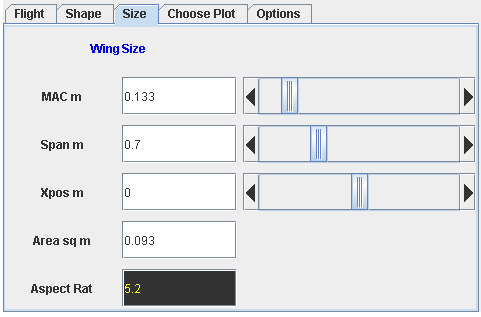
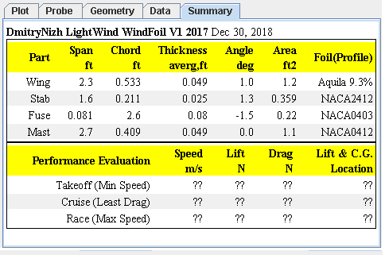
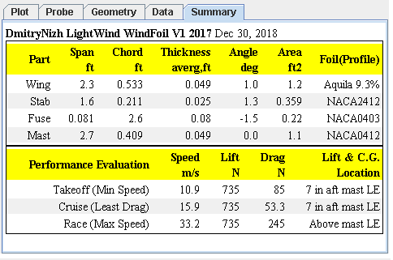

## Guide To GUI Panels


### Top Left Panel

Has 3 Views: Edge, Forces, 3DMesh.  2 text rows the bottom, display Name, Make and Year parameters of the foil and, for convenience, current speed of the craft in knots, miles per hour, kilometers per hour and meters per second. 

#### Edge View

Displays crosscut (a.k.a. profile) of one of 4 hydrofoil parts - Wing, Stab, Mast, Fuse. The one displayed corresponds to the current selection on the top left pane.  Here is Moses Fluente wing in Edge View:


Has a Display sub-menu adding streamlines (moving or frozen), or airfoil geometry to the 2D view. The Edge View is the only Top Left Panel View preserved mainly "as is" from NASA FoilSim III.  

#### Forces View

Displays side view of the entire water-craft in flight, including the rider and the propulsion unit. The cyan-colored area is water, the deep blue colored area is air. The rider, depending on the configuration, is displayed either with a kite bar and lines, or with windsurfing sail, boom and mast. The position of the rider reflects the inputs - the tool computes the center of gravity location needed to stabilize the craft at given flight mode (speed, altitude), and moves the rider alone the board automatically. The vertical Zoom slider control on the left controls rendering scale. The Forces slider controls the scale of forces arrows. The Display menu toggles force arrow labels on/off. Here are a few snapshots:


#### 3D Mesh View


Displays a 3D rendering of the hydrofoil unit as 3d mesh.  The board is not rendered in the 3D Mesh View. The mesh model can be rotated with mouse and zoomed with a slider bar (no mouse-wheel-controlled zooming yet). The Display menu allows to select either perspective view or orthographic view.

### Top Right Panel

This is main dashboard - zone with instant results of foil performance under current conditions. 


As a rule, any change in any parameter inputs affects some of all numbers on this dashboard.
There are 9 rows here. The top row displays make, model name and year of the foil. Second row is 
a group of 4 buttons. The one with yellow background is currently selected part.  The next four  rows contain 4 columns  of results - one for each of 4 parts. The top two rows display lift or Cl and drag or Cd.
The next row is Lift to Drag (L/D) Ratio. The last row of per-part data is Reynolds number. 
The remaining 3 rows are *not*  per-part, instead these are aggregations: Total Lift, Total Drag, Total L/D, Power required to move the craft under current conditions.  The Units drop-down selector allows to chose Metric Scientific, Imperial, Metric kg/kmh, Naval, Imperial ft unit systems. The units are:

**Imperial**: pounds (Lbs), miles per hour (mph), Inches (in), Horsepower HP
**Metric Scientific**: Newtons (N), meters per sec (m/s), meters (m), Watts (W)
**Metric kg,kmh**: kilograms (kg), kilometers per hour (kmh), centimeters (cm), Watts (W)
**Naval**: pounds (Lbs), Knots (kt), Inches (in), Horsepower HP
 **Imperial ft**: pounds (Lbs), miles per hour (mph), Feet (ft), Horsepower HP

CG to Mast LE  describes the position of Rider center of gravity (CG) in relation tot the leading edge of the Mast at its junction with the Board.  Normal, comfortable riding is when CG is a few inches in front of ("fore") Mast LE. 


### Bottom Left Panel

Has the following tabs: **Flight Shape Size ChoosePlot Options**
Many tabs have "parameter rows" - a group of a Label, Input textbox and a Slider bar with the text box and slider bar linked internally. Each parameter has a min and max limits, and out-of bounds inputs are autocorrected. 

#### Flight Tab


The tab contains two sections. The top section contains flight control inputs. The bottom section is Velocity Prediction Module (aka "VPP").

The top section allows to enter craft speed, altitude of the board above water, load (defined as rider weight plus craft weight minus kite/sail uplifting force) and craft pitch.
All these can be altered using either a text input box or a slider bar. When any of the sliders move, rider position changes automatically as required to balance the forces in the left-right, up-down plane.  

Note that the units displayed are Si - meters per second, Newtons - by default. Units can be changed with a selector located in the middle of the top right panel (it's near the red button Help).

The button "Pitch of Balanced Flight" is a simple goal-seeking function to find out the "right' craft pitch for given positions of the 4sliders. The checkbox "Autoadjust Pitch for Equilibrium" does it automatically each time when something changes (for example, each time when speed is altered). The checkbox "Autoload Strut/Mast" turns "on" a complex computational mode that finds out an angle of the strut/mast that is required to generate enough sideways force to counterbalance kite/sail side force (aka heeling force). 

The VPP module of the tool evaluates various performance goals, such as "what is the speed of minimal drag?". The VPP section of the left bottom panel has several rows, each with a solver button on the left and corresponding constraints on the right. Currently, there are 3 solvers supported, hence there are 3 such rows.

"Find Lowest TakeOff speed" goal seeks the speed required for the craft to transition from displacement travel (slow travel where the board is partly immersed in the water) into flight. The constraints specify the minimal lift required and maximum permissible drag. The lift required can be seen as the weight of the craft+rider minus the upward lift of kite/sail. The maximum permissible drag corresponds to maximum available forward pull from the propulsion element (kite, sail). These numbers must be different for kite-foiling and windfoiling! A kiter can greatly reduce the Lowest
TakeOff speed by sending the kite in fast motion across and thus generating significant upward lift and forward drive; the sail of a windfoiler can not reduce the weight at takeoff noticeably, and the drive generated at takeoff is rather much smaller than that of a fast moving kite, even when the windfoiler pumps vigorously. 


### Shape Tab


Airfoil profile parameters of the currently selected Part (yellow rectangle on the Results Panel). On the top, a drop-down selector displays the name of the airfoil of the part - whatever was specified in the config file or was previously selected - and allows to alter it at any time.  By default the list of shapes includes NACA 4 Series and several fixed shapes such as Aquill9.3% and NACA 63-412. When FoilSimIII shapes are enabled with parameter USE_FOILSIM_FOILS set to true, the list also includes Joukowski, Ellipse and Flat Plate. These work OK in FoilBoard, but because these are 'analytical' foils, computation of Cl and Cd for them takes time and various plots may run slow. This can be optimized with some caching added,  but doing so was low priority because the emphasize was on foils used in real hydrofoils. 

The button "Import from File" does exactly what the name says -  allows to import a new airfoil from a file defining airfoil profile geometry.  

Below that button there are several rows of controls allowing to alter the shape.  For fixed-profile airfoils such as Aquilla shown on the image above, Camber and Thickness parameters are locked. 
Below the  parameter controls there are several buttons that help to quickly set a certain common shape. 
All such shapes are supported by NACA 4 family. For instance,  pressing "Flat Bottom" sets Shape to NACA 4 Series, Camber to 2.5 and Thickness  to 9. "Flat Plate" sets Camber to 0 and Thickness to 1. 
When FoilSimIII shapes are enabled, some of these buttons select FoilSim 'analytical' foils.

### Size Tab




Only two parameter inputs with sliders are here: Chord and Span. The values are displayed according to the Units selection on the Results Panel, Si is the default. The Area input box allows to scale Chord and Span to given Area size. For parts with complex geometry Chord is  *Mean Chord* value. Aspect Rat is the value of aspect ration which is  Span/Chord. 

### Choose Plot Tab


This input tab  defines what plot is displayed on the right.  Below are screenshots of some of the selections, with commentary.


This shows equilibrium conditions at various speeds, with Rider Gravity Center (CG) position, total drag, board pitch and total Lift/Drag ratio shown. For trained eye these parameters tell a lot about hydrofoil craft performance. The vertical red line corresponds to takeoff speed.  


Drag of various Foil parts including Junction Drag for Wings-to-fuse connection and Spray Drag of the Mast at various board velocities. 
Typically, each foil has a sweet-spot where total drag is the  lowest.  Such velocity of minimal drag is higher than takeoff speed.  Normally, drag of Wing, Fuse and Stab contribute to that, each having a dip as shown. The 2nd Solver from the Flight tan finds this speed of minimal drag. 


Polar Plot for AoA in the range from -20 to 20. In addition to classic Cl/Cd plot for infinite geometry (aka *2D*,  aka *Profile*), a line for Aspect-ratio-corrected Cl vs  Profile Cd, and a line for that versus Induced drag corrected Cd are also shown. The later is what  defines foil part's actual performance. 


Part's total drag with various components of that plotted separately. Spray drag is computed only for the Mast part. 

### Bottom Right Panel

This is multi-tabbed panel with the tabs Summary and Plot being the most useful for foil evaluation.  

#### Summary Tab



Summary displays a table with concise description of foil parts - span, chord, area, airfoil used, etc - and a table with teh resukts of VPP evaluation. When evaluation for some of the solvers was not yet done, question marks are displayed as shown above. Otherwise the rows provide the results:



#### Data Tab

This is an expansion of the results shown on the Summary tab.  Here is one example of the content:

````
Hydrofoil: DmitryNizh LightWind  WindFoil V1 2017
     Date: Sun Dec 30 19:20:29 PST 2018

 *** Main Wing ***
 Aquila 9.3% Airfoil
 Chord = 16.246 cm.
 Span = 72.961 cm.
 Surface Area = 1185.324 sq cm.
 Thickness = 1.51 cm or 9.3 % of chord ,
 Camber = 4.0 % chord ,
 Angle of attack = 1.0 degrees ,
 Position LE at 0.0 cm aft fuse LE

 *** Stabilizer Wing ***
 NACA 4 Series Foil
 Chord = 6.445 cm.
 Span = 51.796 cm.
 Surface Area = 333.825 sq cm.
 Thickness = 0.772 cm or 11.982 % of chord ,
 Camber = -2.0 % chord ,
 Angle of attack = 1.359 degrees ,
   Effective AoA due to Wing flow influence: -1.033,
 Position LE at 76.999 cm aft fuse LE

 *** Mast (a.k.a. Strut) ***
 NACA 4 Series Foil
 Chord = 12.484 cm.
 Span = 84.913 cm.
 Surface Area = 1060.053 sq cm.
 Thickness = 1.495 cm or 11.982 % of chord ,
 Camber = 0.0 % chord ,
 Angle of attack = 0.0 degrees ,
 Position LE at 35.0 cm aft fuse LE

 *** Fuselage ***
 NACA 4 Series Foil
 Chord = 81.982 cm.
 Span = 2.494 cm.
 Surface Area = 204.463 sq cm.
 Thickness = 2.455 cm or 2.995 % of chord ,
 Camber = 0.0 % chord ,
 Angle of attack = -1.559 degrees ,
 Position LE at 0.0 cm aft fuse LE

Tail Volume: 1.379


 Water Density = 1027.037kg/cu m
 Pressure = 806.458kPa, Temperature = 16C,
 Speed = 17.9Kts, or 33.2 km/hr ,
  Lift = 737.8
  Drag  = 230.5


This foil has been evaluated for minimum possible 
takeoff speed.
It was found that with required uplift force of 
735.0 Newtons or 165.2 Lbs or 74.9 kg 
and total hydrodynamic drag not exceeding 
85.0 Newtons or 19.1 Lbs or 8.6 kg 
it can take off at speed of foiling as low as 
5.9 kt or 6.8 mph or 10.9 km/h or 3.0 m/s
Lift is located 7 in aft mast.

This foil has been evaluated for minimum possible 
drag during cruising at speeds >= takeoff speed.
It was found that with required uplift force of 
735.0 Newtons or 165.2 Lbs or 74.9 kg 
total hydrodynamic drag would be minimal
and not exceeding 
53.2 Newtons or 11.9 Lbs or 5.4 kg 
L/D ratio = 13.7, when cruise-foiling at 
8.6 kt or 9.9 mph or 15.9 km/h or 4.4 m/s
Lift is located 7 in aft mast.

This foil has been evaluated for maximum possible 
sustained, controllable flight speed.
It was found that with required uplift force of 
735.0 Newtons or 165.2 Lbs or 74.9 kg 
and total hydrodynamic drag not exceeding 
245.0 Newtons or 55.0 Lbs or 24.9 kg 
it can maintain sustained flight speed of at least 
17.9 kt or 20.6 mph or 33.2 km/h or 9.2 m/s
Lift is located Above mast.
````

#### Plot Tab

This shows the plot selected on the left, see screenshots in the "Choose Plot Tab" section above. 


> Written with [StackEdit](https://stackedit.io/).
