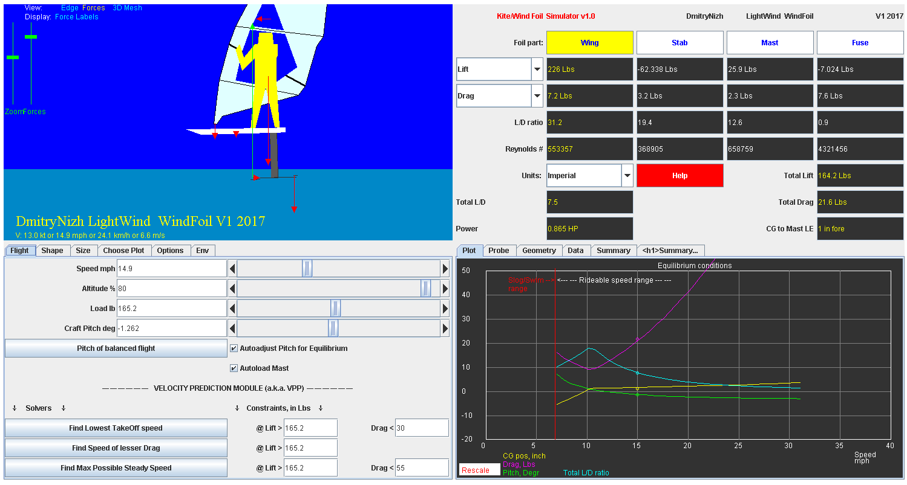
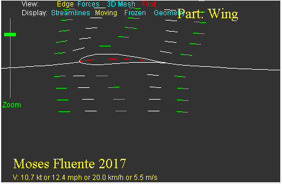
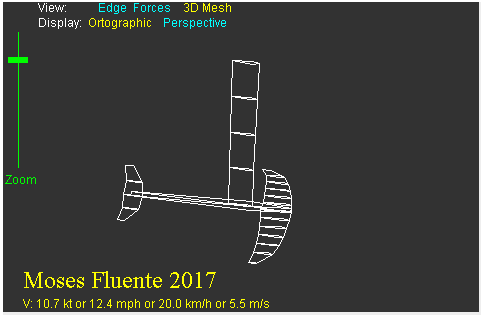
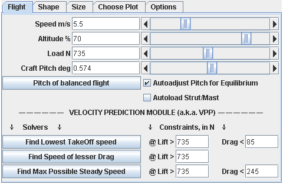

## Guide To GUI Panels

### Top Left Panel

Has 3 Views: Edge, Forces, 3DMesh.  2 text rows the bottom, display Name, Make and Year parameters of the foil and, for convenience, current speed of the craft in knots, miles per hour, kilometers per hour and meters per second. 

#### Edge View

Displays crosscut (a.k.a. profile) of one of 4 hydrofoil parts - Wing, Stab, Mast, Fuse. The one displayed corresponds to the current selection on the top left pane.  Here is Moses Fluente wing in Edge View:

Has a Display sub-menu adding streamlines (moving or frozen), or airfoil geometry to the 2D view. The Edge View is the only Top Left Panel View preserved mainly "as is" from NASA FoilSim III.  

#### Forces View

Displays side view of the entire water-craft in flight, including the rider and the propulsion unit. The cyan-colored area is water, the deep blue colored area is air. The rider, depending on the configuration, is displayed either with a kite bar and lines, or with windsurfing sail, boom and mast. The position of the rider reflects the inputs - the tool computes the center of gravity location needed to stabilize the craft at given flight mode (speed, altitude), and moves the rider alone the board automatically. The vertical Zoom slider control on the left controls rendering scale. The Forces slider controls the scale of forces arrows. The Display menu toggles force arrow labels on/off. Here are a few snapshots:

#### 3D Mesh View

Displays a 3D rendering of the hydrofoil unit as 3d mesh.  The board is not rendered in the 3D Mesh View. The mesh model can be rotated with mouse and zoomed with a slider bar (no mouse-wheel-controlled zooming yet). The Display menu allows to select either perspective view or orthographic view.

### Bottom Left Panel

Has the following tabs: **Flight Shape Size ChoosePlot Options**

#### Flight Tab

The tab contains two sections. The top section contains flight control inputs. The bottom section is Velocity Prediction Module (aka "VPP").

The top section allows to enter craft speed, altitude of the board above water, load (defined as rider weight plus craft weight minus kite/sail uplifting force) and craft pitch.
All these can be altered using either a text input box or a slider bar. When any of the sliders move, rider position changes automatically as required to balance the forces in the left-right, up-down plane.  

Note that the units displayed are Si - meters per second, Newtons - by default. Units can be changed with a selector located in the middle of the top right panel (it's near the red button Help).

The button "Pitch of Balanced Flight" is a simple goal-seeking function to find out the "right' craft pitch for given positions of the 4sliders. The checkbox "Autoadjust Pitch for Equilibrium" does it automatically each time when something changes (for example, each time when speed is altered). The checkbox "Autoload Strut/Mast" turns "on" a complex computational mode that finds out an angle of the strut/mast that is required to generate enough sideways force to counterbalance kite/sail side force (aka heeling force). 

The VPP module of the tool evaluates various performance goals, such as "what is the speed of minimal drag?". The VPP section of the left bottom panel has several rows, each with a solver button on the left and corresponding constraints on the right. Currently, there are 3 solvers supported, hence there are 3 such rows.

"Find Lowest TakeOff speed" goal seeks the speed required for the craft to transition from displacement travel (slow travel where the board is partly immersed in the water) into flight. The constraints specify the minimal lift required and maximum permissible drag. The lift required can be seen as the weight of the craft+rider minus the upward lift of kite/sail. The maximum permissible drag corresponds to maximum available forward pull from the propulsion element (kite, sail). These numbers must be different for kite-foiling and windfoiling! A kiter can greatly reduce the Lowest
TakeOff speed by sending the kite in fast motion across and thus generating significant upward lift and forward drive; the sail of a windfoiler can not reduce the weight at takeoff noticeably, and the drive generated at takeoff is rather much smaller than that of a fast moving kite, even when the windfoiler pumps vigorously. 

> Written with [StackEdit](https://stackedit.io/).
